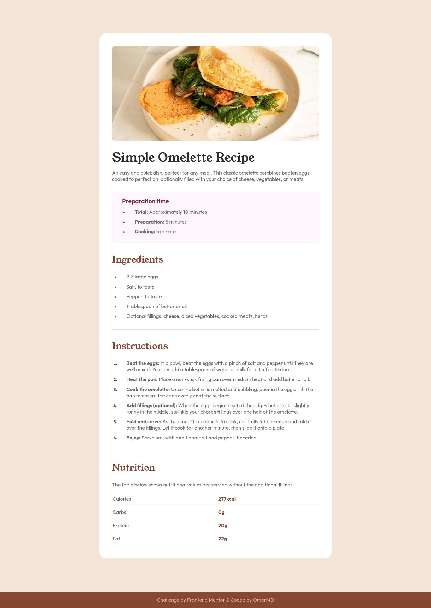
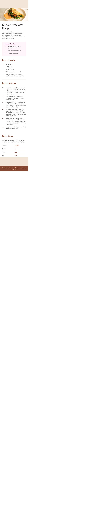

# Frontend Mentor - Recipe Page

## Table of contents
- [Overview](#overview)
  - [The challenge](#the-challenge)
  - [Screenshot](#screenshot)
  - [Links](#links)
- [My process](#my-process)
  - [Built with](#built-with)
  - [What I learned](#what-i-learned)
  - [Continued development](#continued-development)
- [Author](#author)
- [Acknowledgments](#acknowledgments)

# Overview

Meh I don't like the look of table of contents but I guess they're nice...?

## The challenge

Well replicate this as closely as I can... *sigh*
[Recipe page challenge on Frontend Mentor](https://www.frontendmentor.io/challenges/recipe-page-KiTsR8QQKm)

### Screenshot

Web Version



Mobile Version




### Links

- Solution URL: [Add solution URL here](https://github.com/MaskeyDude/recipe-page-main_forntendo)
- Live Site URL: [Add live site URL here](https://maskeydude.github.io/recipe-page-main_forntendo/)

## My process

I left it for a long time then remembered again and realized that I actually enjoy it lol. I did the html stuff first then css ... yeah

### Built with

- HTML
- CSS

### What I learned

- Ahm... I already did try tables but now know how to actually use them ._.

- How to color only the marker/number of a list!!

```css
ol li::marker {
    font-weight: bold;
    color: hsl(14, 45%, 36%);
}
```

- Finally fixed fonts not apprearing in firefox (Just change default/other fonts to basic ones: Serif, sans-serif & monospace)

- That I really like this method of using fonts:

```css 
@import url();
/* font-family: ; */
```

- Finally remembered this blank thingy:
```html
<a href="#" target="_blank">This link will open in another tab</a>
```

### Continued development

I really like front end projects but I just get kinda overwhelmed on where to start after seeing a fresh blank project. Well.. I also like writing readme.md and only started avoiding them as I got confused. So now I'm not really gonna focus on finishing stuff instead just do as much as I wanna yeah as at the end of the day it's for practice anyway :>

## Author

- Website - [OmerM](https://www.omerm.42web.io/index.html)
- Frontend Mentor - [@MaskeyDude](https://www.frontendmentor.io/profile/MaskeyDude)

## Acknowledgments

W3schools and online dudes who post solutions really helped me.